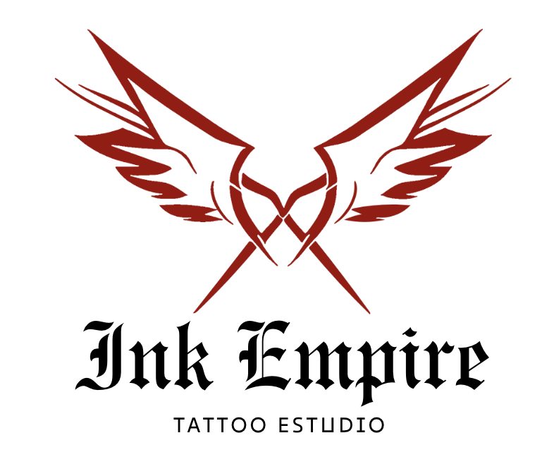

# 🏢 Tattoo Studio Appointment Management System

This project aims to develop the frontend system for a tattoo studio appointment management system. The system allows users to register, log in, and access their personal area, where they can view and create appointments for various services offered by the studio.

  

## 🛠️ Services

The studio offers the following services:

- **Custom Tattoos**: Clients can select unique designs and motifs, personalizing their tattoo experience according to their preferences and tastes.
- **Catalog Tattoos**: The studio offers a variety of pre-designed tattoos from its catalog, allowing clients to choose from a range of stylized and proven options.
- **Tattoo Restoration and Rejuvenation**: The studio specializes in restoring and rejuvenating existing tattoos, working to improve and revitalize old tattoos.
- **Piercing and Dilator Placement**: The studio offers professional piercing and dilator placement services, guaranteeing safe procedures and varied styles to satisfy individual client preferences.
- **Piercing and Merchandise Sales**: In addition to its application services, the studio offers a selection of piercings and other body art-related products, allowing clients to purchase quality items to complement their unique style.

## ⚙️ Stack

## Local installation option

1. Clone this repository:
`$ git clone https://github.com/More-Pe/frontend-TattooShop.git`
3. Navigate to the project directory:
$ `$ cd frontend-TattooShop`
2. Install node modules:
`$ npm install -y`
3. Start the development server:
`$ npm run dev`

## Deploy 🚀

    <a href="https://tattooshop.zeabur.app"><strong> Tattoo Studio Deploy </strong></a>

## 📸 Screenshots

| Page        | Screenshot                                       |
|-------------|--------------------------------------------------|
| **Home Page**   |    |
| **Services**   |      |
| **Create appintment**  |   |
| **View my appointments**| |
| **Profile**     |          |

## 🌟 To improve

In order to enhance the overall user experience and functionality of the application, the following improvements are planned:

1. **General Design Enhancement**: We aim to refine and enhance the overall design of the application to make it more user-friendly, visually appealing, and intuitive.

2. **Add Catalog of Piercings and Tattoos**: We will introduce a comprehensive catalog that includes a variety of piercings and tattoos, allowing users to browse and explore different styles and options.

3. **Add Contact Page**: A dedicated contact page will be added to provide users with a straightforward way to get in touch with us for inquiries, appointments, and support.

4. **Add Tattoo Artists Page**: We will create a page dedicated to showcasing our talented tattoo artists, including their portfolios and professional backgrounds, to help users choose the right artist for their needs.

## 📞 Contact

 